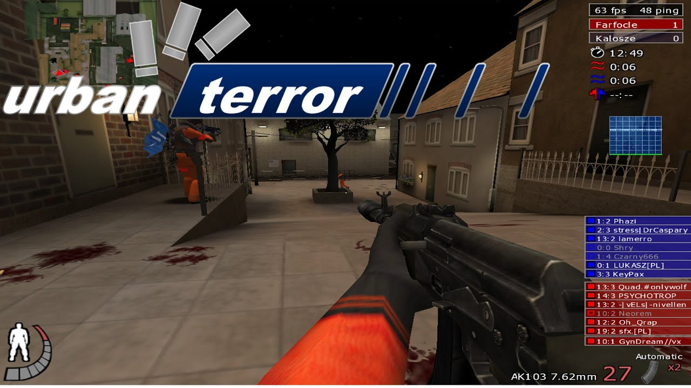
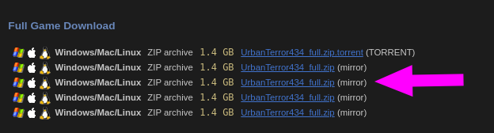
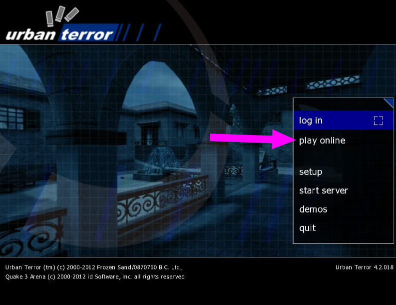
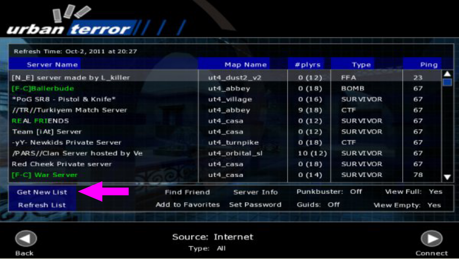
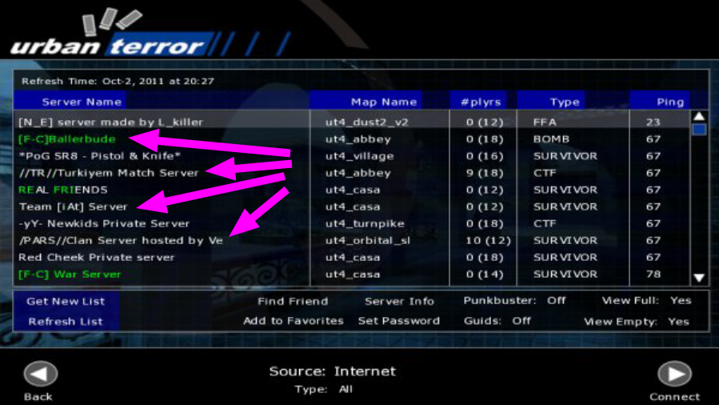

# [Urban Terror](https://www.urbanterror.info/home/)



## Instalación (Bueno solo se descarga y ejecuta)

1. Descargar el juego desde su  [página principal](https://www.urbanterror.info/downloads/)

	

2. Descomprimimos 
	
	```bash
	$ unzip UrbanTerror434_full.zip
	$ tree -L 1 UrbanTerror43
		.
		├── q3ut4
		├── Quake3-UrT.app
		├── Quake3-UrT-Ded.exe
		├── Quake3-UrT-Ded.i386
		├── Quake3-UrT-Ded.x86_64
		├── Quake3-UrT.exe
		├── Quake3-UrT.i386
		└── Quake3-UrT.x86_64

		2 directories, 6 files
	```

3. Ejecutamos el juego

	```bash
	$ cd UrbanTerror43
	$ ./Quake3-UrT.x86_64
	```

	

4. clic en: **Get New List**

	

5. Seleccionamos un servidor para empezar a jugar

	
