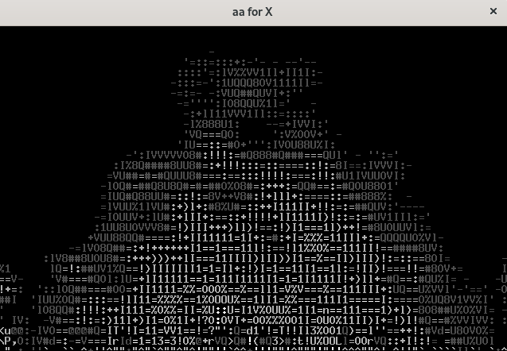
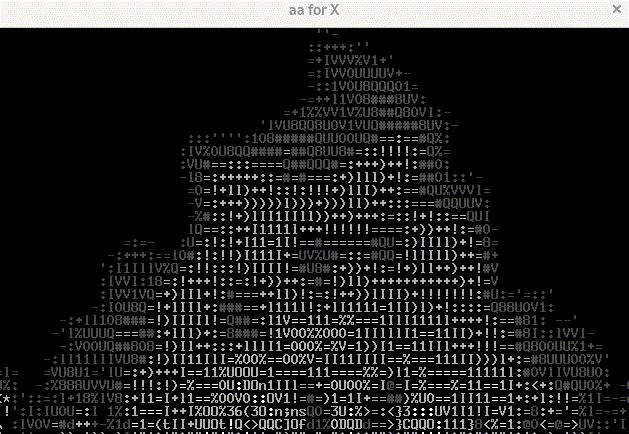

# aafire: animación de fueguito tipo chimenea al estilo de asciiart
> **[Puedes ver el video tutorial aquí](https://www.youtube.com/watch?v=l71AwM0mun8 "Clic para acceder al video")**
1. Instalación
   ```
   $ sudo apt install libaa-bin
   ```
2. Para ver la animación
   ```
   $ aafire
   ```
   
   

> **[Puedes ver el video tutorial aquí](https://www.youtube.com/watch?v=l71AwM0mun8 "Clic para acceder al video")**
