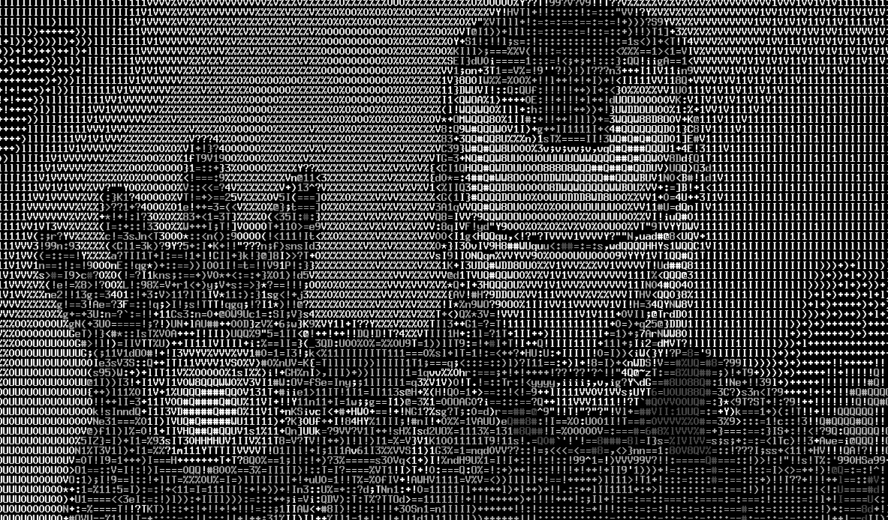
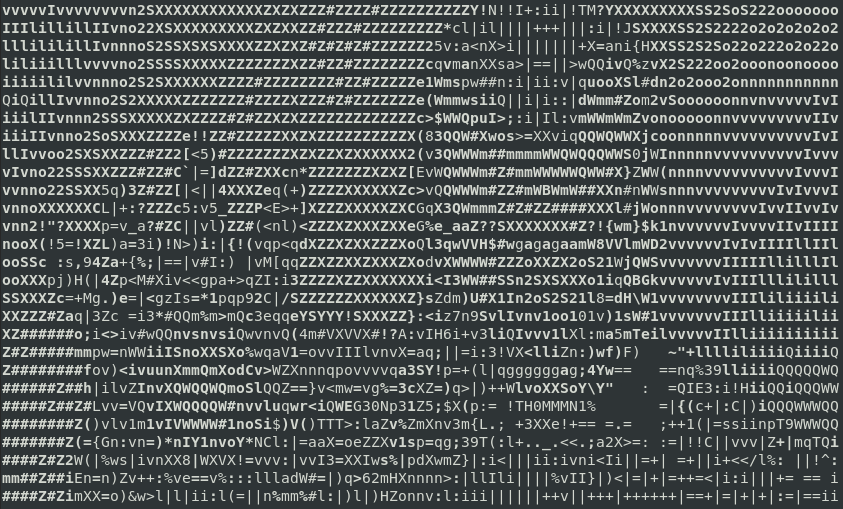

# aview: Obtener imagen conformada por caracteres ascii
>**[Clic para ver el video del tutorial](https://www.youtube.com/watch?v=9dNRnJonB6I "click para ver el video")**
1. Instalación
   ```
   $ sudo apt install aview
   ```
   * Tengo esta imagen con la cual vamos a trabajar: ironman.png
   

2. Ahora procedemos a visualizar
   ```
   $ asciiview ironman.png
   ```
   

3. Este permite poder copiarlo y uasrlo para pegarlo en un archivo de texto
   ```
   $ asciiview ironman.png -driver curses
   ```
   
   
>**[Clic para ver el video del tutorial](https://www.youtube.com/watch?v=9dNRnJonB6I "click para ver el video")**
   
