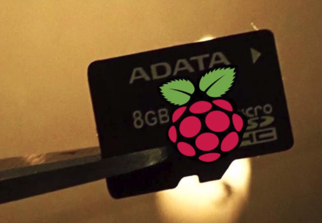

# Hacer backup del Sistema Operativo de la Raspberry Pi

1. Vemos las particiones de la microSD. 
   Sobre la partición que tenemos que trabajar es: **mmcblk0**
   ```
   $ df -h
   $ lsblk
   ```
   
2. Hacer backup (El backup 'raspbian.img' de mi microSD de 16GB pesa 15GB) y ver el progreso del proceso
   ```
   $ sudo dd bs=4M if=/dev/mmcblk0 of=/media/MiUsb/raspbian.img status=progess conv=fsync
   ```
   <br>
3. Listo! Ya tenemos una copia de seguridad del sistema operativo que tiene la microSD de nuestra Raspberry Pi, guardando en: raspbian.img <br><br>
4. S iqueremos copiar la copia de seguridad que hicimos a otra microSD
   ```
   $ sudo dd bs=4M if=/media/miUSB/raspbian.img of=/dev/sdb status=progress conv=fsync 
     /dev/sdb: suponiendo que corresponde a la microSD donde vas a copiar
   ```
