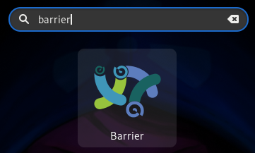
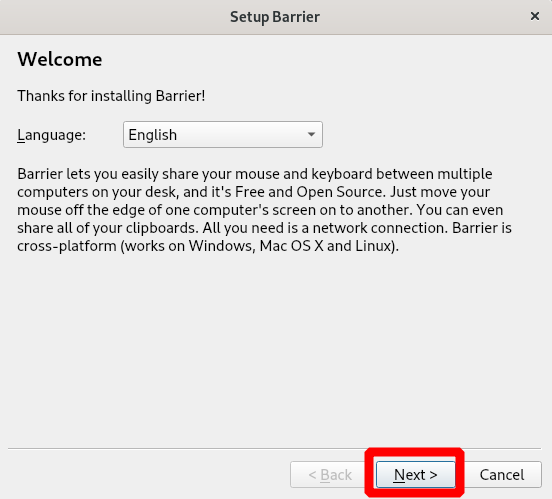
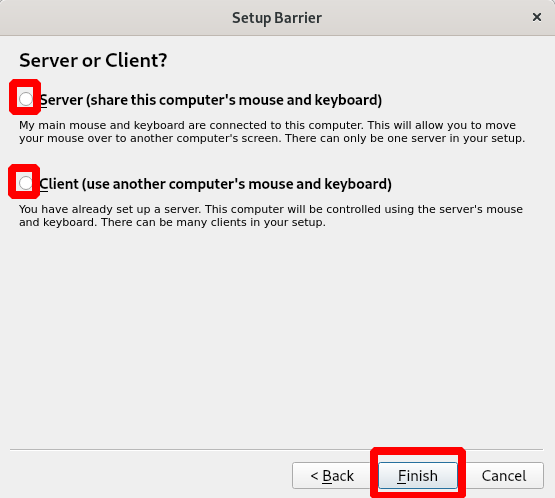
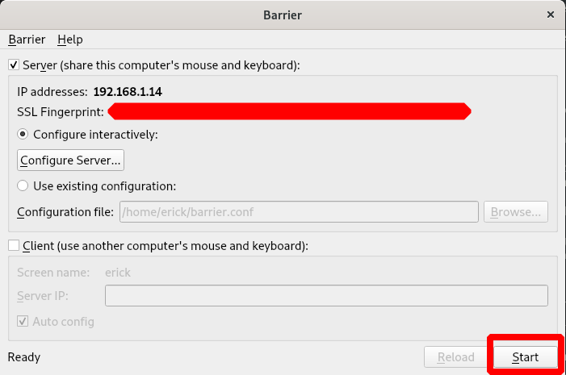
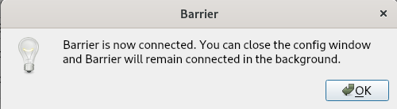
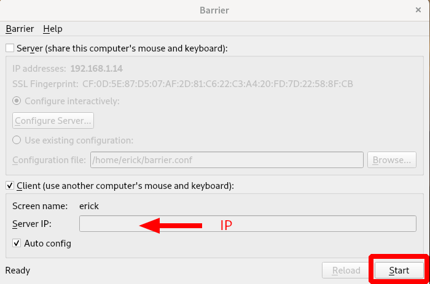
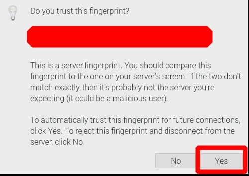

# barrier: usar tu mouse y teclado en multiples computadoras  
## Instalación  
Se instala en el cliente y servidor  
```
$ sudo apt install barrier
```
## Configuración  
1. Abrimos el programa   
	
2. Elegimos el idioma y click en: Next  
	
3. Primero tienes que iniciar el servidor, luego los clientes    
	
	1. Servidor  
		
		
	2. Cliente  
		
		
4. Listo. Ya puedes usar el mouse y teclado del servidor en los clientes que instalaste e iniciaste barrier  
