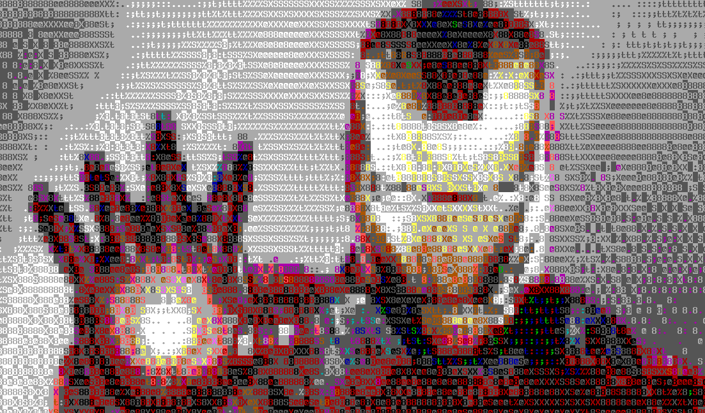

# Visualizar una imagen como caracteres de colores
1. Instalación
   ```
   $ sudo apt install caca-utils
   ```
   * Esta es la imagen con la que vamos a trabajar: ironman.jpg
     

2. Visualizar la imagen como caracteres de colores
   ```
   $ cacaview ironman.jpg
   ```
   
   
