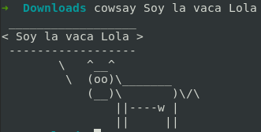
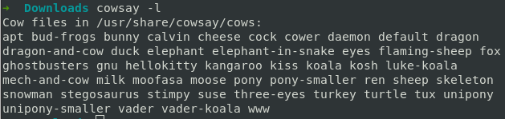
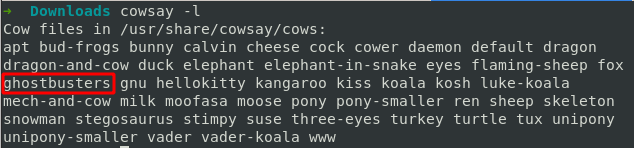
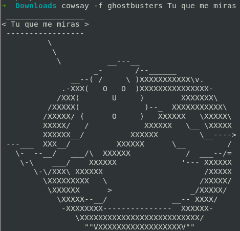

# cowsay: simpáticas imágenes formadas por caracteres ascii con un mensaje que tu le indiques
>**[Clic aquí para ver el video tutorial](https://www.youtube.com/watch?v=wiDfU29G9HY "Dale clic sin miedo")**

1. Instalación
   ```
   $ sudo apt install cowsay
   ```
2. Probamos
   ```
   $ cowsay Soy la vaca Lola
   ```
   
3. Si no nos gusta la vaquita podemos cambiarla. Para ver las diferntes opciones
   ```
   $ cowsay -l
   ```
   
4. Podemos escoger todas estas opciones. Yo escogeré **ghostbusters**
   ```
   $ cowsay -f ghostbusters Tu que me miras
   ```
   

   
   
>**[Clic aquí para ver el video tutorial](https://www.youtube.com/watch?v=wiDfU29G9HY "Dale clic sin miedo")**
