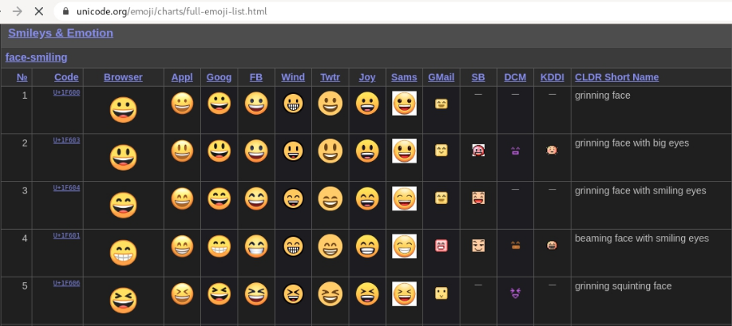
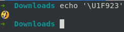
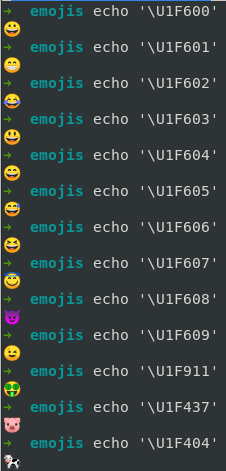

# Emojis en tu terminal
1. Nos dirigimos a: [Full Emoji list](https://unicode.org/emoji/charts/full-emoji-list.html "Dale clic para ver los emojis")
   

2. Copiamos uno de ejemplo: U+1F923
3. Modificamos y colocamos en la terminal
   ```
   $ echo '\U1F923'
   ```
   
4. Listo! Ahora prueba con otros emojis. Por cierto, esto lo he probado en mi sistema operativo Debian y Ubuntu, yo no uso Windows XD
   

