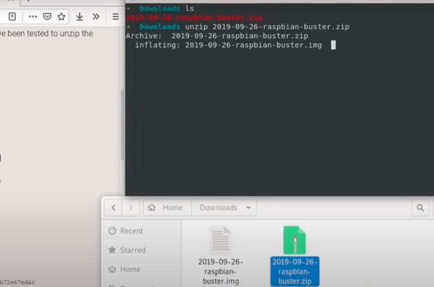

# Grabar sistema operativo Raspbian a una microSD en Gnu/Linux (No es necesario formatear la microSD)
>**[Clic aquí para ver el video tutorial](https://www.youtube.com/watch?v=1SbhmrY4ps8 "Dale clic para ver el tutorial")**
1. Descargar la imagen que contiene el sistema operativo Raspbian desde su página oficial  
   [Clic aqui para ir a la página oficial de descarga](https://www.raspberrypi.org/downloads/raspbian/ "Clic aqui para abrir el link de descarga")
   
   

2. Descomprimimos  
   ```
   $ unzip 2019-09-26-raspbian-buster.zip
   ```
   

3. Al descomprimir obtendremos el archivo **2019-09-26-raspbian-buster.img**  
4. Conectamos nuestra microSD a la computadora  
   
   
   

5. Saber localización de la microSD y particiones. En mi caso es: /dev/sdc  
   ```
   $ df -h
   $ sudo fdisk -l
   $ lsblk
   ```
   
6. Desmontamos la partición  
   ```
   $ sudo umount /dev/sdc
   ```
 
7. Grabamos la imagen .img en la microSD usando el comando dd y se verá el progreso de la copia  
   ```
   $ sudo dd bs=4M if=2019-09-26-raspbian-buster.img of=/dev/sdc status=progress conv=fsync

   if : donde esta la imagen.img
   of : destino, es decir, nuestra microSD      
   ```
   
   

8. Listo! Ya podemos conectar la microSD a nuestra Raspberry Pi y arrancar el sistema operativo  
   
   
   

>**[Clic aquí para ver el video tutorial](https://www.youtube.com/watch?v=1SbhmrY4ps8 "Dale clic para ver el tutorial")**

   
