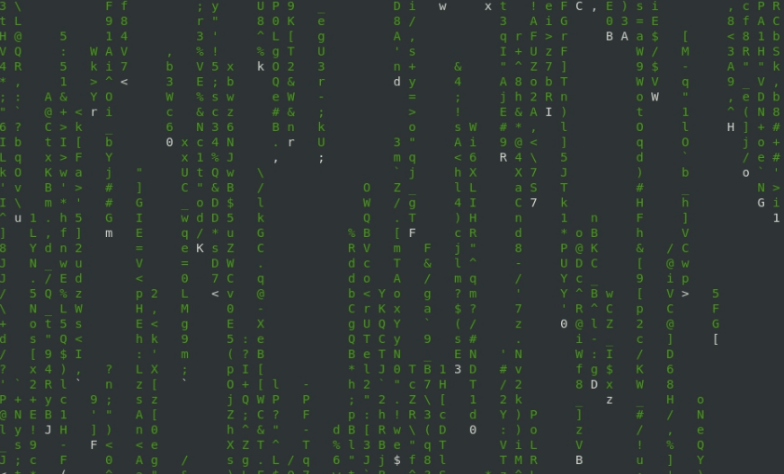

# cmatrix: Efecto Matrix en tu terminal
>**[Clic aquí para ver el video tutorial](https://www.youtube.com/watch?v=gaUYkyx-6bU "Dale clic sin miedo")**
1. Instalación
   ```
   $ sudo apt install cmatrix
   ```
2. Ejecución
   ```
   $ cmatrix
   ```
   

>**[Clic aquí para ver el video tutorial](https://www.youtube.com/watch?v=gaUYkyx-6bU "Dale clic sin miedo")**
