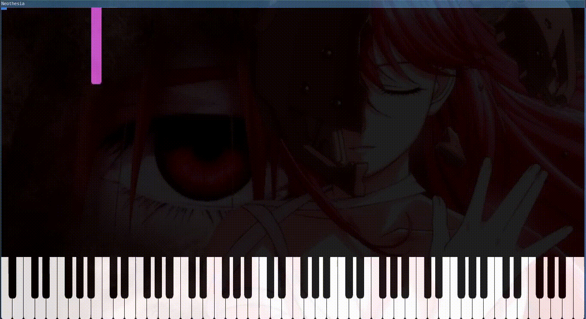

# [Neothesia](https://github.com/PolyMeilex/Neothesia)

> [**Tutorial en mi canal youtube**](https://www.youtube.com/watch?v=IKMlYcaOhKE "Click aqui")


## Instalación y Ejecución

```sh
$ flatpak install flathub com.github.polymeilex.neothesia 
$ flatpak run com.github.polymeilex.neothesia
```

1. Seleccionamos archivo midi (musica.mid) 

	

2. click en **Play**  

	[](https://vm.tiktok.com/ZM8t5nFPQ/)
