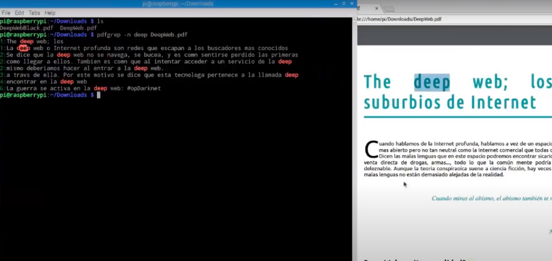

# pdfgrep: Buscar palabras de un archivo PDF en la terminal Gnu/Linux
>**[Clic para ver el video tutorial](https://www.youtube.com/watch?v=dJtV9VMrnhc "Clic para ver el video")**

1. Instalación
   ```
   $ sudo apt install pdfgrep
   $ man grep
   ```
2. Buscar palabra en el archivo pdf
   ```
   $ pdfgrep palabra archivo.pdf
   ```
3. Buscar frase en archivo pdf
   ```
   $ pdfgrep "frase que quiero" archivo.pdf
   ```
4. Mostrar línea de texto y la página donde aparece la palabra
   ```
   $ pdfgrep -n palabra archivo.pdf
   ```
5. Contar las veces que aparece una palabra en cada pagina
   ```
   $ pdfgrep -p palabra archivo.pdf
   ```
6. Contar las veces que aparece una palabra en tdo el documento pdf
   ```
   $ pdfgrep -c palabra archivo.pdf
   ```
7. Busca la palabra hasta el número que le indiquemos (Reemplazar el 3 por el que desees)
   ```
   $ pdfgrep -m 3 palabra archivo.pdf
   ```
8. Busca palabra en todos los .pdf cuyos nombres empiecen con "Deep"
   ```
   $ pdfgrep -r --include "Deep*.pdf" palabra
   ```
9. Buscar palabra entodos los .pdf que pesen menos de 12MB
   ```
   $ find . -name “*.pdf” -size -12M -print0 | xargs -0 pdfgrep palabra
   ```
>**[Clic para ver el video tutorial](https://www.youtube.com/watch?v=dJtV9VMrnhc "Clic para ver el video")**
>**[Documentación oficial](https://pdfgrep.org/doc.html "clic para ver la documentación oficial")**
   

