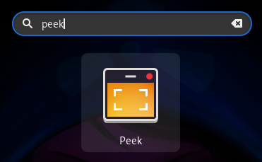
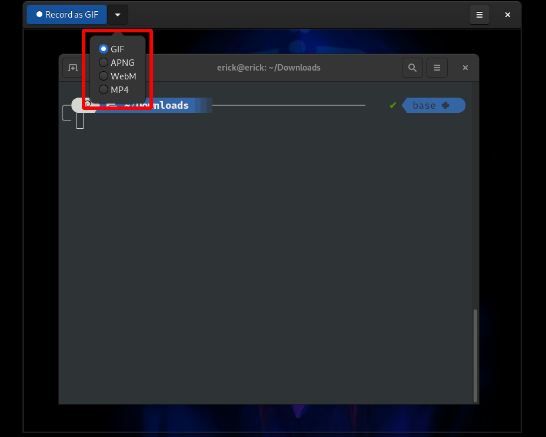
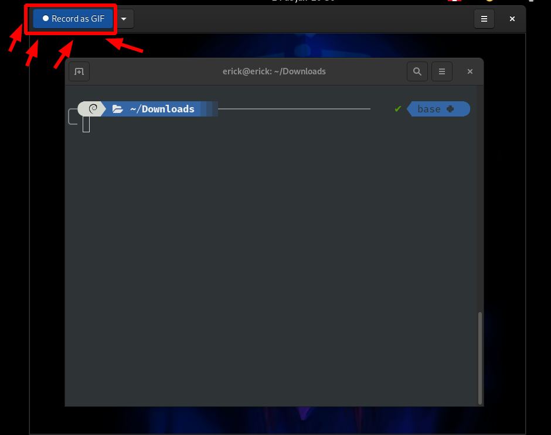
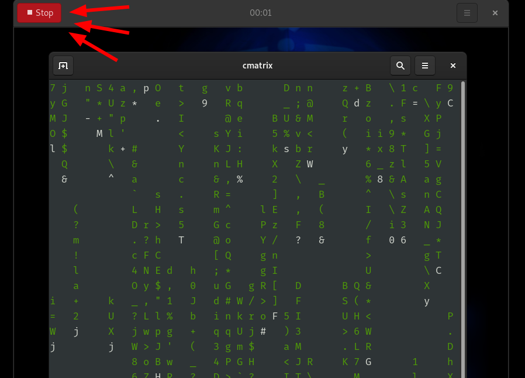
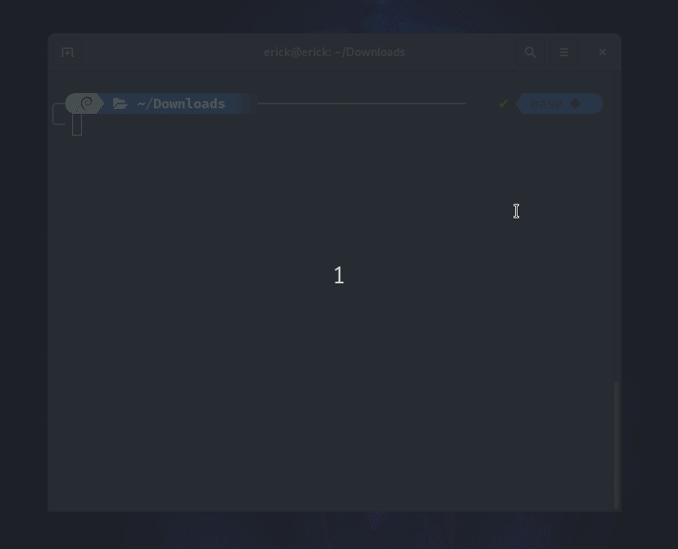

# peek: grabar en formato .gif
## Instalación  
```
$ sudo apt install peek
```
## Grabar  
1. Abrimos el programa   
	
2. Tenemos estos formatos disponibles para grabar  
	
3. Con la ventana de "peek" encerramos el área que queremos que grabe y click en: Record as GIF   
	
3. Para detener la grabación, click en: Stop    
	
4. Y Listo, ya tenemos nuestro GIF  
	
