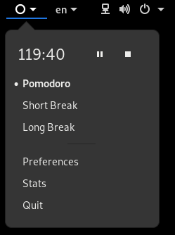

# Pomodoro: Método para mejorar la administración del tiempo  
> [Link de la página principal](https://gnomepomodoro.org/)

<div style-"text-align:center"></div>  

## Instalación  
1. Dependencias  
	```
	$ sudo apt install autoconf-archive gettext valac pkg-config desktop-file-utils appstream-util libappstream-glib-dev libglib2.0-dev gsettings-desktop-schemas-dev gobject-introspection libgirepository1.0-dev libsqlite3-dev libgom-1.0-dev libgstreamer1.0-dev libgtk-3-dev libcanberra-dev libpeas-dev libappindicator3-dev
	```
2. Pomodoro  
	```
	$ sudo apt install gnome-shell-pomodoro
	```
## Interfaz  
1. Para iniciar  
	  
	  
2. Preferencias  
	  
	  
3. Estadísticas  
	  
	
	  
	
