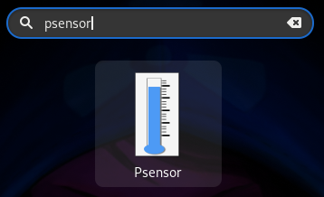
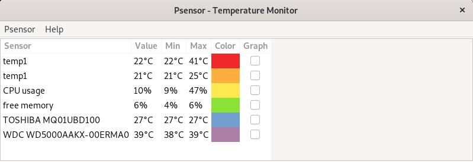

# psensor: Ver la temperatura de nuestra PC Gnu/Linux (Debian)
1. Instalación  
	```
	$ sudo apt install psensor
	```
2. Ejecución  
	1. Desde el entorno gráfico  
		
	2. Desde la terminal  
		```
		$ psensor
		```
3. Ya podemos visualizar la temperatura en nuestra PC en tiempo real  
	

