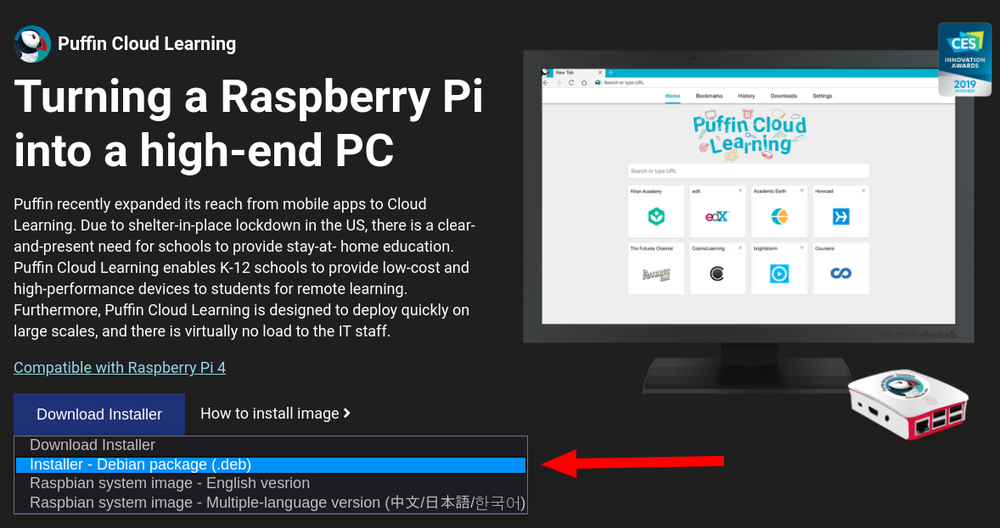

# Puffin: Navegador super ligero    
## Instalación en Raspberry Pi OS  
1. Entrar en la [página oficial de Puffin](https://www.puffin.com/raspberry-pi/)  
2. Descargar el .deb  
	
3. Tendremos esto: 
	```
	puffin-internet-terminal-demo_8.2.4.705_armhf.deb  
	```
4. Lo instalamos así:   
	```
	$ sudo dpkg -i puffin-internet-terminal-demo_8.2.4.705_armhf.deb
	```
