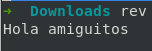
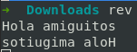
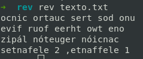

# rev: revertir las letras de una palabra, frase e incluso todas las líneas de un archivo de texto
1. Revertir las letras  
   ```
   $ rev
   ```
     
   

2. Revertir las letras de un archivo de texto  
   * Tengo este archivo de texto  
     ```
     $ ls
     ```
     

   * Vemos el contenido de este archivo de texto  
     ```
     $ cat texto.txt
     ```

     

   * Ejecutamos rev para revertir las letras de todo el contenido del archivo de texto  
     ```
     $ rev texto.txt
     ```
     
