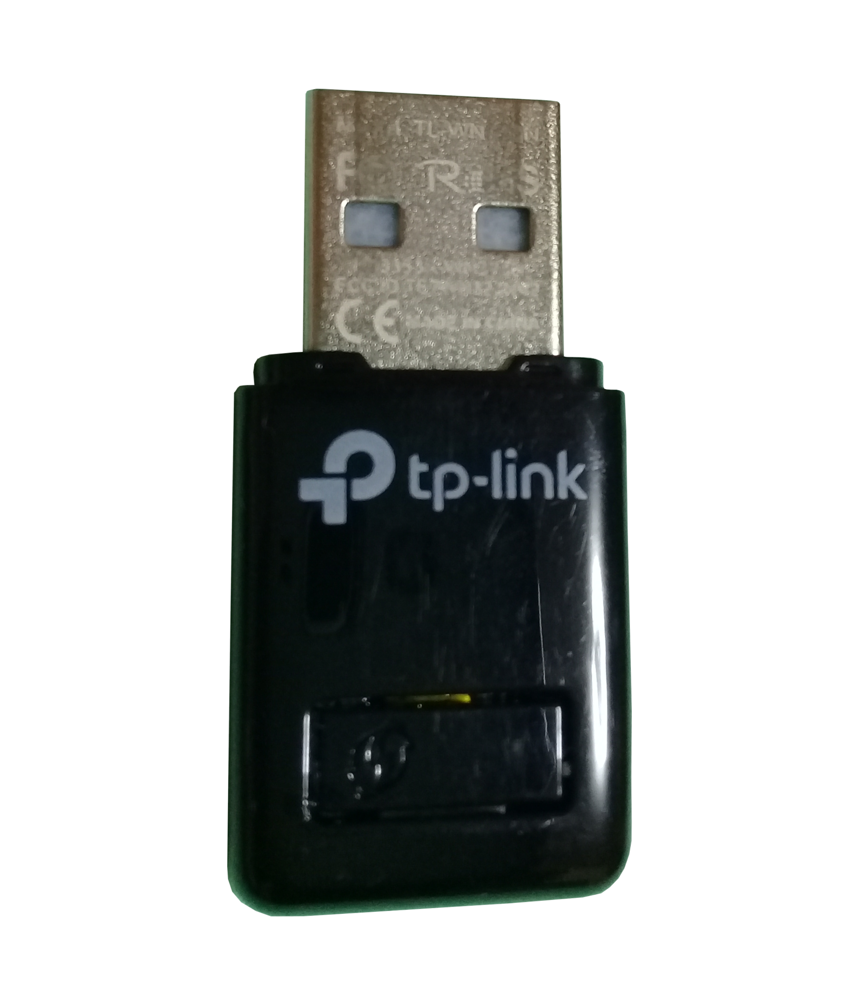
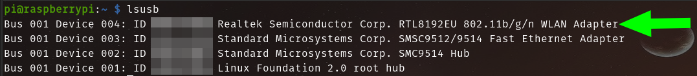

# Driver usb wifi rtl8192EU

|[tp-link TL-WN823N V2](https://www.tp-link.com/es/home-networking/adapter/tl-wn823n/)	| Realtek			|
|---------------------------------------|---------------------------------------|
|	|  	|
|300 Mbps				|300 Mbps				|
|USB 2.0				|USB 2.0				|

## Raspberry Pi

1. Este es el driver de mi usb wifi que necesito

	

2. Veo la versión del kernel 

	```
	$ cat /proc/version
	    Linux version 5.10.63-v7+
	```

3. Busco en [fars-robotics.net](http://downloads.fars-robotics.net/wifi-drivers/8192eu-drivers/) el driver para mi versión de kernel  
	* Mi version de kernel es: **5.10.63-v7+**  
	* Entonces descargo la última versión: **8192eu-5.10.63-v7-1460.tar.gz**  
	* Si no funciona pruebo con las versiones anteriores

		

	* También pueden encontrar estos otros [drivers](http://downloads.fars-robotics.net/wifi-drivers/)

		

4. Descomprimimos

	```
	$ tar xf 8192eu-5.10.63-v7-1460.tar.gz
		8192eu.conf
		8192eu.ko
		install.sh
	```

5. Ejecutamos la instalación y reiniciamos

	```
	$ ./install.sh
	$ sudo reboot
	```

	
