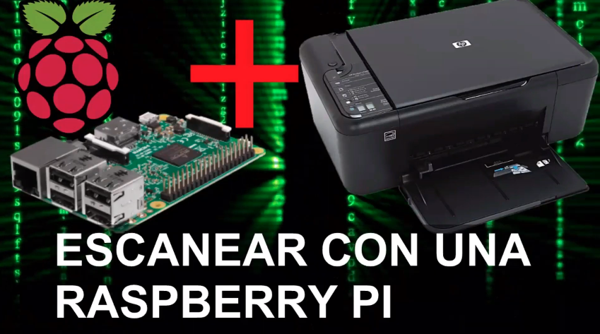
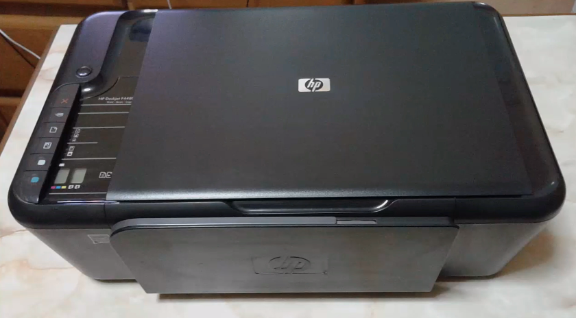
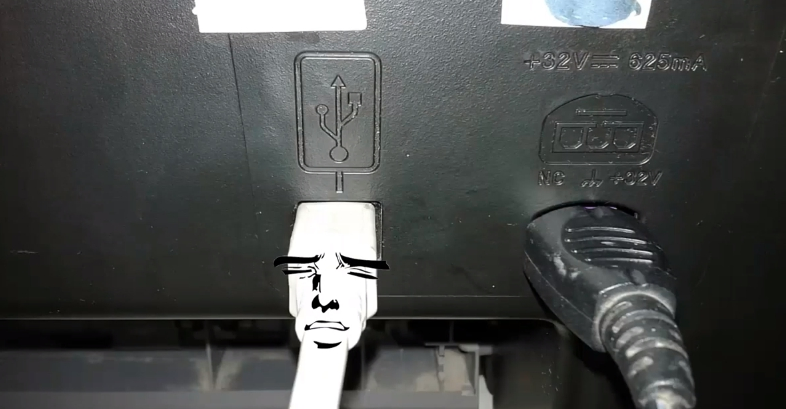
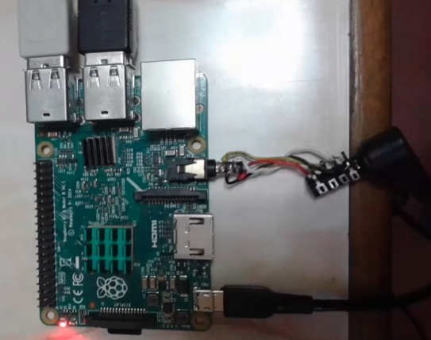
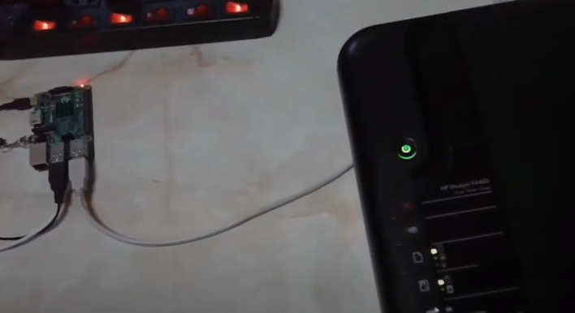
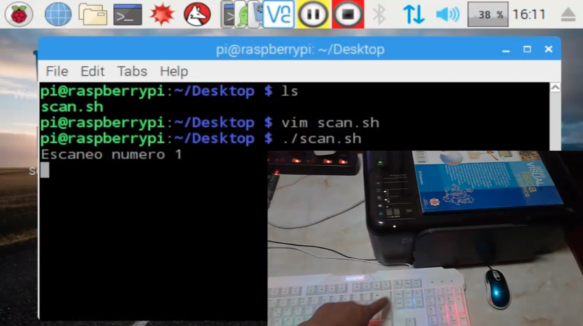

# sane + hplip: Usar tu impresora escáner HP para escanear usando la terminal de una Raspberry Pi
>**[Clic para ver el video tutorial](https://www.youtube.com/watch?v=W6Qe1dYgHRA "Clic para vel el video tutorial")**

1. Instalación  
   ```
   $ sudo apt install sane sane-utils
   $ sudo apt install hplip
   ```
   * Yo tengo esta impresora escáner HP
     
3. Debemos hacer las conexiones necesarias  
   
   
   
4. Vemos si nuestro escaner esta conectado a la red  
   ```
   $ scanimage -L
   ```
5. Ver todas las opciones  
   ```
   $ scanimage -h
   ```
6. Escanear una imagen por defecto  
   ```
   $ scanimage >1.pdf
   ```
7. Ver progreso  
   ```
   $ scanimage --progress >1.pdf
   ```
8. Escanear con una buena resolución  
   ```
   $ scanimage --resolution 300 >1.pdf
   ```
9. Escanear con tamaño específico  
   ```
   $ scanimage -x 100 -y 100 >1.pdf
   ```
10. (-l=top left x) (-t=top left y)  
   ```
   $ scanimage -l 0mm -t 0mm >1.pdf
   ```
11. Escanear con formato específico (En estos formatos no hay problemas)  
   ```
   $ scanimage --format=tiff >1.pdf
   $ scanimage --format=tiff >1.pnm
   ```
12. Convertir a jpg o png (rápido)  
   ```
   $ scanimage | convert - imagen.jpg
   $ scanimage | convert - imagen.png
   ```
13. PNG a tamaño al 50% del tamaño original  
   ```
   $ scanimage | convert --resize 50% imagen.png
   $ scanimage | convert --resize 50% imagen.jpg
   ```
14. Resoluciones  
   * Muy buena  
     ```
     $ scanimage --resolution 300 | convert - imagen.png
     ```
   * Regular  
     ```
     $ scanimage --resolution 200 | convert - imagen.png
     ```
   * mala  
     ```
     $ scanimage --resolution 100 | convert - imagen.png
     ```
15. Script para escanear una y otra vez cuando presionemos la tecla ENTER  
    * Este es el contenido del script: **scan.sh**  
      ```
      #!/bin/bash
      for i in {1..1000}
         do
    		read -p "Escaneo numero $i"
    		scanimage --resolution 300  | convert - $i.jpg
         done 
      ```
    * Le damos permisos de ejecución al script  
      ```
      $ chmod +x scan.sh
      ```
    * Ejecutar el script  
      ```
      $ ./scan.sh
      ```
      
 
>**[Clic para ver el video tutorial](https://www.youtube.com/watch?v=W6Qe1dYgHRA "Clic para vel el video tutorial")**
