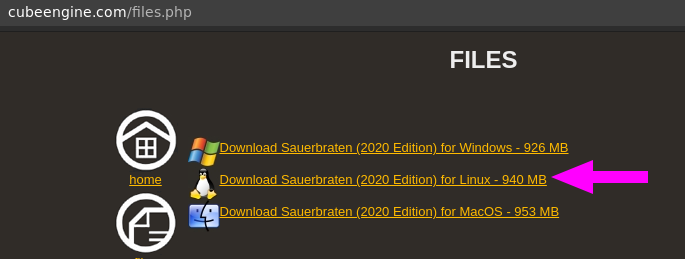
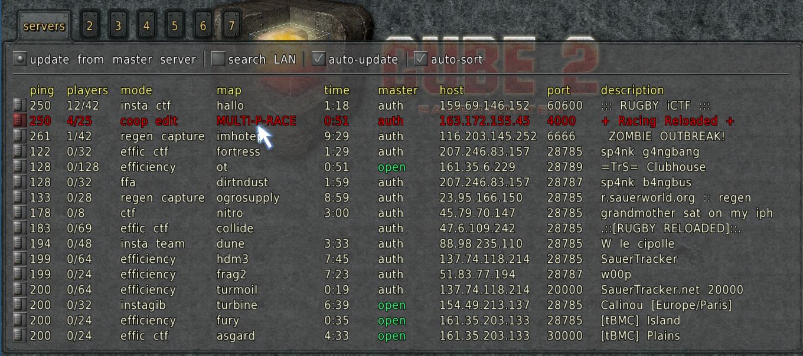
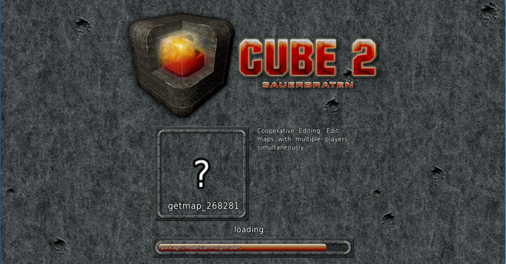
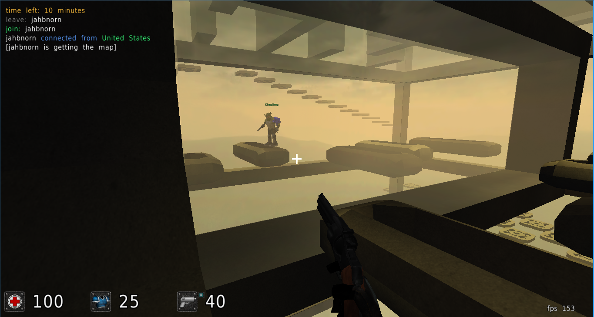

# [Sauerbraten](http://sauerbraten.org/)


## Instalación en Debian
1. Descargar de: **http://cubeengine.com/files.php**

	

2. Dependencias (Tal vez en tu caso no es necesario este paso, pero en Debian si he tenido que hacerlo)

	```bash
	$ sudo apt install libsdl2-mixer-2.0-0 libsdl2-image-2.0-0 libsdl2-ttf-2.0-0
	$ sudo apt install libSDL-ttf2.0-0
	$ sudo apt install libSDL-ttf2.0-0:i386
	```

3. Descomprimimos y compilamos

	```bash
	$ tar -jxvf sauerbraten_2020_12_27_linux.tar.bz2
	$ cd sauerbraten
	$ cd src
	$ make clean all install
	$ cd ..
	```

## Jugar en un servidor
1. Ejecutar el juego

	```bash
	$ ./sauerbraten_unix
	```

2. Seleccionamos un servidor disponible para jugar

	

	

	

	
