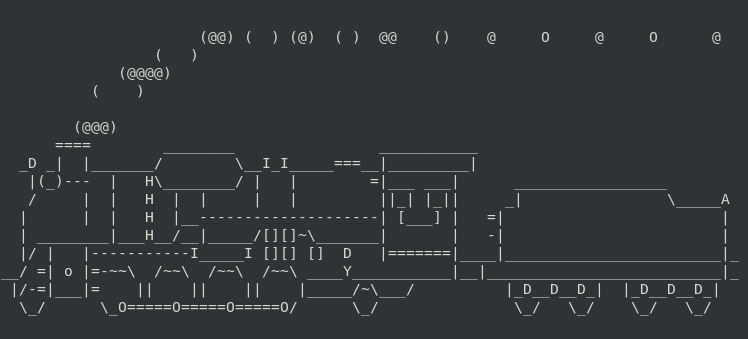

# sl: Hacer aparecer un trencito animado en tu terminal
>**[Chequea mi video tutorial](https://www.youtube.com/watch?v=wQk5aBdxvZI "Clic para vel el tuto")**
1. Instalar
   ```
   $ sudo apt install sl
   ```

2. Al ejecutar aparecerá un trencito
   ```
   $ sl
   ```

   

>**[Chequea mi video tutorial](https://www.youtube.com/watch?v=wQk5aBdxvZI "Clic para vel el tuto")**
