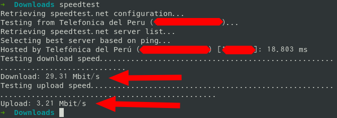
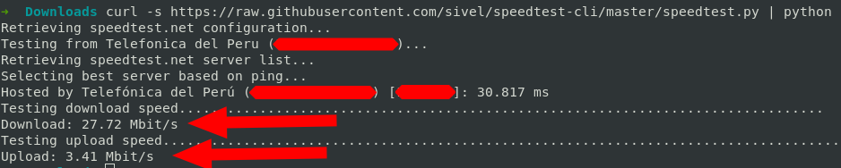

# Test de la velocidad de internet
1. Instalación  
	```
	$ sudo apt install speedtest-cli
	```
2. Test de tu velocidad de internet (Subida y bajada)  
	1. Usando el comando instalado  
		```
		$ speedtest
		```
		
	2. Sin usar el comando instalado. Se tiene que tener instalado python 3    
		```
		$ curl -s https://raw.githubusercontent.com/sivel/speedtest-cli/master/speedtest.py | python -
		```
		
