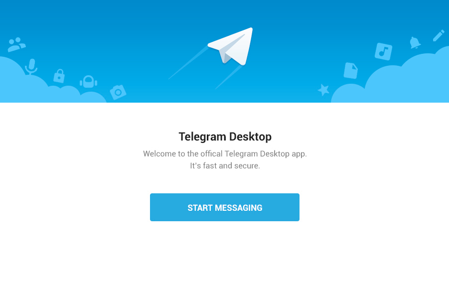
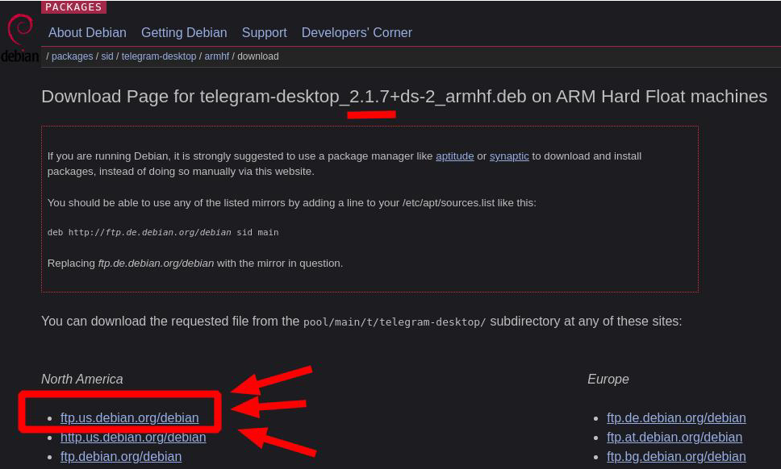
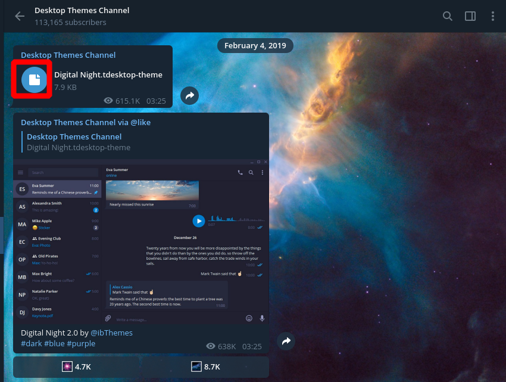
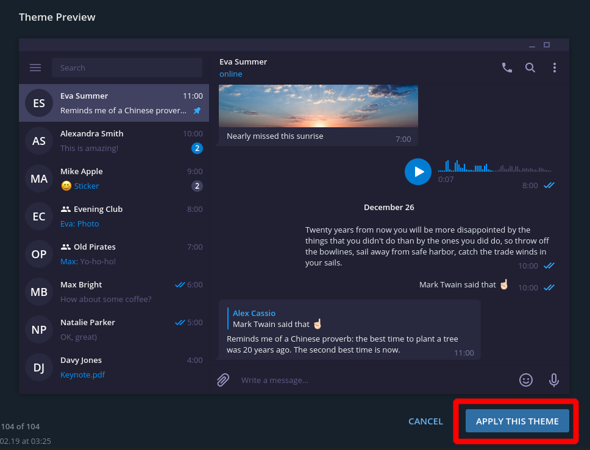

# Telegram

## Instalación: tenemos 2 formas  
* Desde los repositorios  
	```
	$ sudo apt install telegram-desktop
	```
* Descargando el .deb
	1. Descargamos el .deb de [Packages.debian.org](https://packages.debian.org/sid/armhf/telegram-desktop/download)  
		
	2. Instalamos el .deb  
		```
		$ sudo dpkg -i telegram-desktop_2.1.7+ds-2_armhf.deb  
		```
## Cambiar Theme  
1. Buscamos: Desktop Themes Channel  
	
2. Escogemos el theme que nos guste y lo descargamos     
	
3. Click en: Aply This Theme  
	
