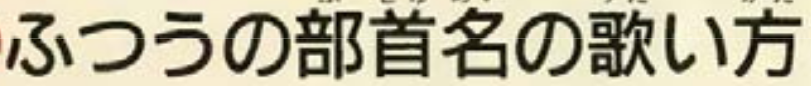

# TESSERACT-OCR: Reconocer caracteres de diversos idiomas  
## Instalación  
1. Tesseract-ocr y otros programas para crear un script    
	```
	$ sudo apt install tesseract-ocr
	$ sudo apt install scrot
	$ sudo apt install xsel
	```
2. Instalar idiomas  
	1. Ver lista de lenguajes instalados  
		```
		$ tesseract --list-langs
		```

	2. Español  
		```
		$ sudo apt install tesseract-ocr-spa 
		```
	3. Japones  
		```
		$ sudo apt install tesseract-ocr-jpn
		```
3. Ver la versión de tesseract que tenemos instalado  
	```
	$ tesseract -v
	```
## Ejemplos    
1. Idioma  
	1. Japonés  
		1. Tengo esta imagen: 1.png  
			
		2. Ejecuto  
			```
			$ tesseract 1.png stdout -l jpn
			```
			
	2. Español  
		1. Tengo esta imagen: 2.png  
			
		2. Ejecuto  
			```
			$ tesseract 2.png stdout -l spa
			```
			
2. Orientación de lectura  
	1. Horizontal
		1. Tengo esta imagen: 1.png  
			
		2. Ejecuto  
			```
			$ tesseract 1.png stdout -l jpn --psm 4
			```
			
	2. Vertical (Hasta ahora no me ha funcionado bien)
		1. Tengo esta imagen: 1.png  
			
		2. Ejecuto  
			```
			$ tesseract 1.png stdout -l jpn --psm 5
			```
3. Generar el texto en un archivo: img.txt
	1. Tengo esta imagen: 1.png  
			
	2. Ejecuto  
		```
		$ tesseract 2.png img -l spa
		```
	3. Se genera un archivo "img.txt" que contiene:  
		```
		El fenómeno “Chupetín Trujillo": La construcción de un
		personaje que nació con el acoso en redes
		```
## Script para seleccionar y copiar en el clipboard  
### Japonés  
1. Script: ocr.sh
	```
	#!/bin/bash
	scrot -s -q 100 capture.png
	tesseract capture.png ocr -l jpn --psm 4
	cat ocr.txt | xsel --clipboard --input
	rm *.png ocr.txt

	```
2. Ejecutar  
	```
	$ ./ocr.sh
	```
3. Seleccionar con el mouse el texto horizontal que deseemos   
	
4. Y automáticamente ya tenemos copiado las letras que encerramos en un rectángulo, podemos pegarlo donde queramos. Como ejemplo lo pego en el Google Translate para traducir lo que tengo copiado.  
	
