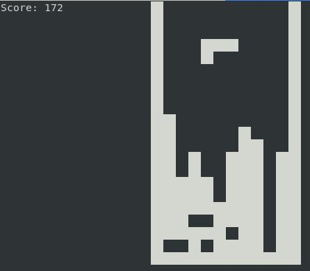
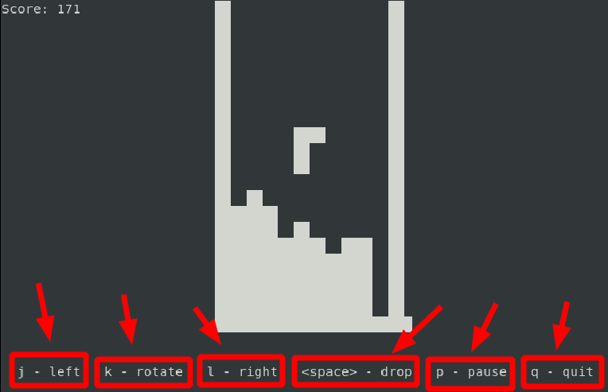
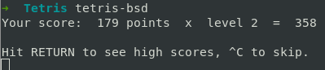

# Jugar tetris en la terminal
1. Instalación  
   ```
   $ sudo apt install bsdgames
   ```
2. Para jugar tetris  
   ```
   $ tetris-bsd
   ```
   

3. En la parte inferior nos indica las letras a usar para jugar  
   ```
   i: izquierda
   k: rotar
   l: derecha
   barra espaciadora: colocar la figura
   p: pausa
   q: salir
   ```

   

4. Al terminar el juego aparece nuestro puntaje y a que nivel hemos llegado.  
   Para salir presionar Ctrl+c  
   
