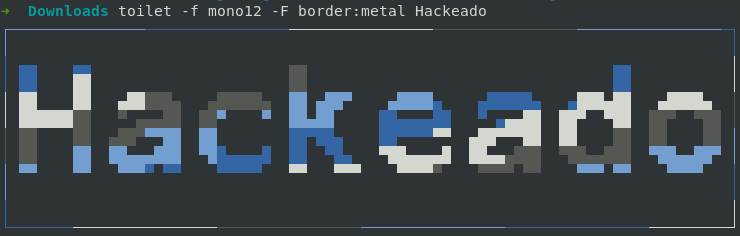
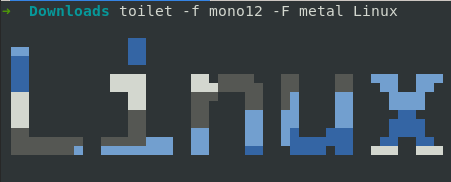
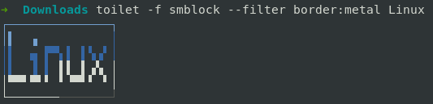
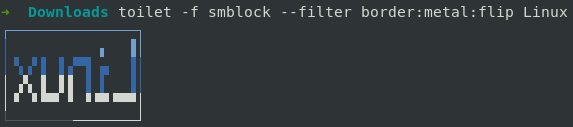
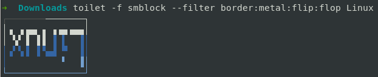

# toilet: Crea banners de texto ascii en la terminal
>**[Clic para ver el video tutorial](https://www.youtube.com/watch?v=QpXOgpCkr8g "Dale clic para ver el tutorial")**

1. Instalación
   ```
   $ sudo apt install toilet
   ```
2. Ejemplo simple
   ```
   $ toilet -f mono12 -F metal Linux
   ```
   

3. Con borde
   ```
   $ toilet -f smblock --filter border:metal Linux
   ```
   

4. Con borde con las letras al revés de derecha a izquierda
   ```
   $ toilet -f smblock --filter border:metal:flip Linux
   ```
   

5. Banner volteado 180 grados
   ```
   $ toilet -f smblock --filter border:metal:flip:flop Linux
   ```
   

>**[Clic para ver el video tutorial](https://www.youtube.com/watch?v=QpXOgpCkr8g "Dale clic para ver el tutorial")**
   
