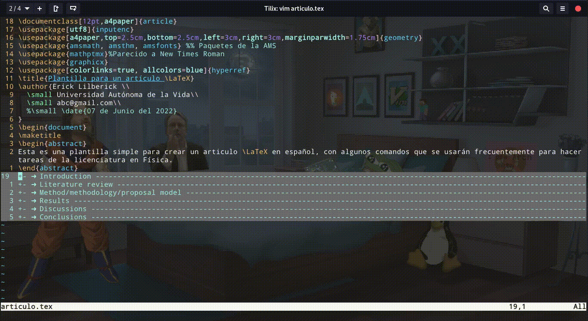

# [vim-tex-fold](https://github.com/matze/vim-tex-fold): folding, minimizar y maximizar

## Instalación mediante vundle

* `$ vim ~/.vimrc`

	```
	call vundle#begin()
	Plugin 'matze/vim-tex-fold'
	call vundle#end()
	```

## shortcuts

shortcut | Descripción
--- | ---
espacio			| ver lo que contiene
zx			| ver lo que contiene
zX			| ocultar lo que contiene


