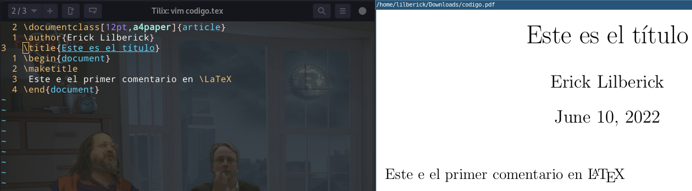

# [vimtex](https://github.com/lervag/vimtex) : previsualiza y compila LaTeX



## Instalación

* `$ vim ~/.vimrc`

	```
	call plug#begin('~/.vim/plugged')
	Plug 'lervag/vimtex'
	call plug#end()
	```

## configuración

* `$ vim ~/.vimrc`

	```
	let g:vimtex_view_method = 'zathura'
	```

## shortcuts

Shortcut	| Descripción
--- | ---
:h vimtex		| ayuda
:h vimtex-requirements	|
:h vimtex-compiler	|
\ll			| compilar
\lk			| detener compilacion
\lc			| limpiar archivos auxiliares
