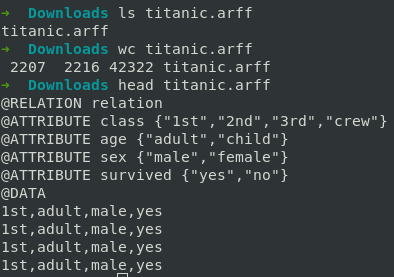
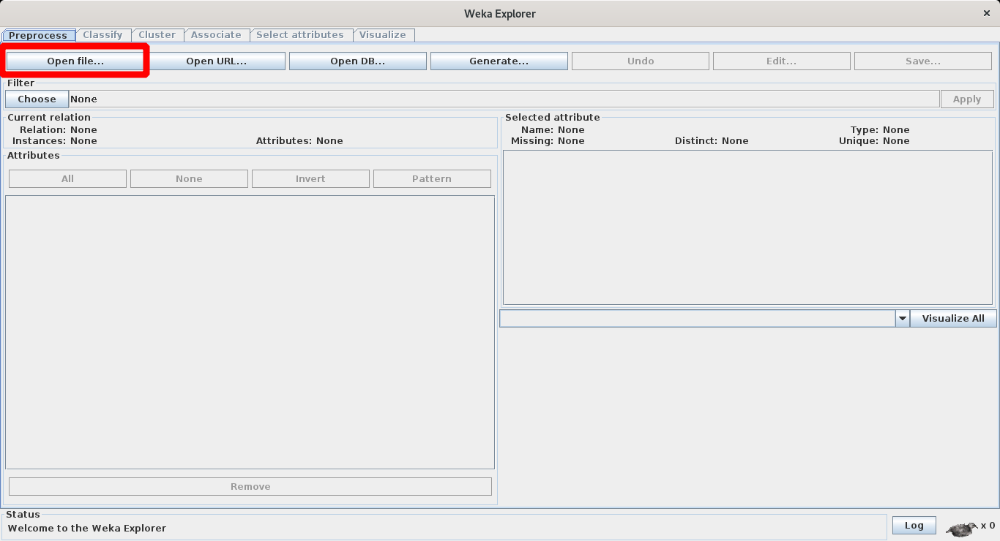
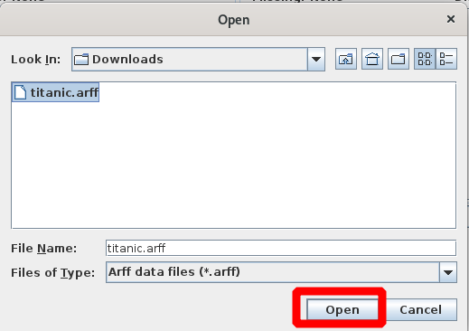
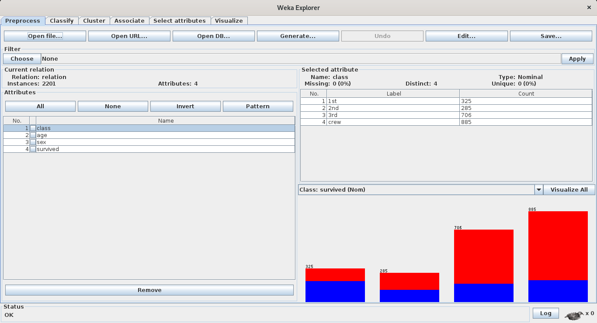

# weka  
## Instalación  
1. Instalamos desde los repositorios   
	```
	$ sudo apt install weka
	$ sudo apt install libsvm-java
	```
2. abrimos el programa  
	1. Desde la terminal  
		```
		$ weka
		```
	2. Desde el entorno gráfico  
		
3. Inicio con weka  
	
## Abrir .arff  
1. Click en: Explorer  
	
2. Tengo el archivo: titanic.arff  
	
3. Click en: Open File  
	
4. Seleccionamos y click en: Open  
	
5. Así es como se muestra  
	
