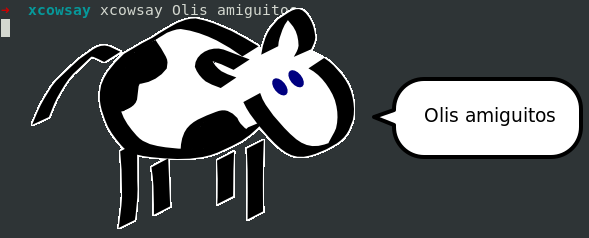
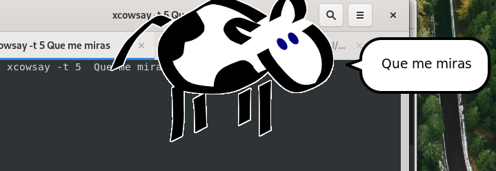

# xcowsay: Hacer aparecer una simpática vaquita con un mensaje que tu le indiques
>**[Puedes ver aquí mi video tutorial](https://www.youtube.com/watch?v=c8LpGk5x-rA "Dale clic para ver mi tutorial")**
1. Instalación  
   ```
   $ sudo apt install xcowsay
   ```
2. Hacemos una prueba  
   ```
   $ xcowsay Olis amiguitos
   ```
   

3. Que muestre por 5 segundos  
   ```
    $ xcowsay -t 5 Que me miras
   ```
   

>**[Puedes ver aquí mi video tutorial](https://www.youtube.com/watch?v=c8LpGk5x-rA "Dale clic para ver mi tutorial")**
