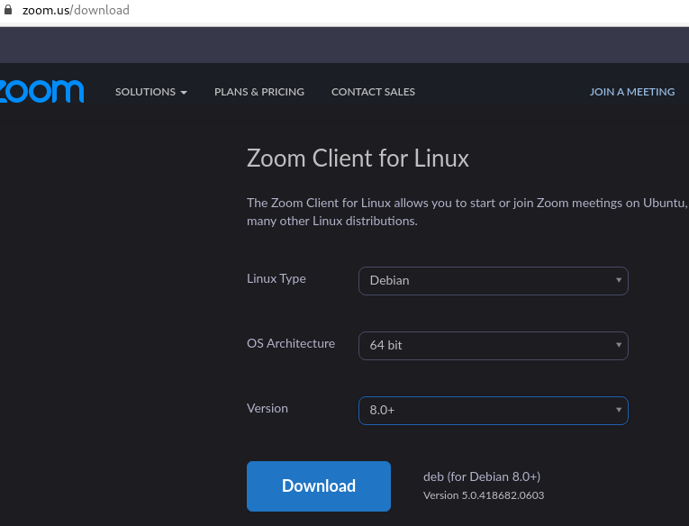
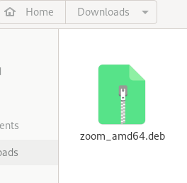

# Videollamadas con zoom :computer: :phone: :iphone: :telephone_receiver: :speaker:
## Instalación de Zoom en Debian (Gnu/Linux)
1. Descargo desde la pagina principal de zoom  
	[Click para ir a la página de descarga](https://zoom.us/download "Dale click papu")  

2. Aquí ya lo tengo descargado  

3. Ejecuto este comando en la terminal para que se intale  
	```
	$ sudo dpkg -i zoom_amd64.deb
	```
4. Listo, ya puedo usar Zoom en Debian  


